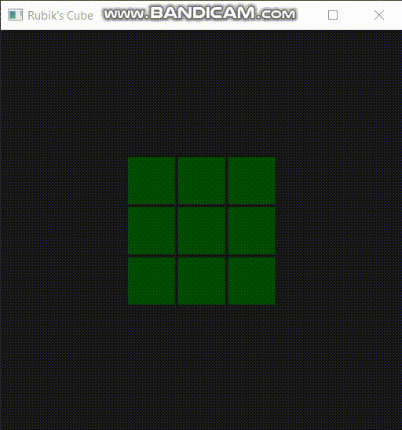

# 🧊 Rubik's Cube (OpenGL)

An interactive 3D Rubik’s Cube built with C++ and OpenGL.  
Rotate faces, scramble the cube, and try solving it with smooth animations and basic lighting.



---

## ✨ Features

- **3D Cube Representation** – models the Rubik’s Cube as 27 sub-cubes.
- **Interactive Controls** – rotate cube faces and view from any angle.
- **Random Scramble** – cube starts in a randomized state.
- **Face Picking** – click or select a face to rotate.
- **Smooth Animations** – face rotations animate smoothly.
- **Basic Lighting** – simple Phong shading for added depth.
- **Lightweight Implementation** – uses modern OpenGL (shaders, buffers) with minimal dependencies.

---

## 🛠️ Getting Started

### Prerequisites

- C++ compiler (e.g. `g++`, `clang`, or Visual Studio)
- OpenGL (GL, GLEW/GLAD, GLUT/GLFW depending on setup)
- Provided helper files: `mat.h`, `InitShaders.cpp`

### Build & Run

```bash
git clone https://github.com/yourusername/rubiks-cube.git
cd rubiks-cube
g++ -o rubiks main.cpp InitShaders.cpp -lGL -lGLU -lglut
./rubiks
```
